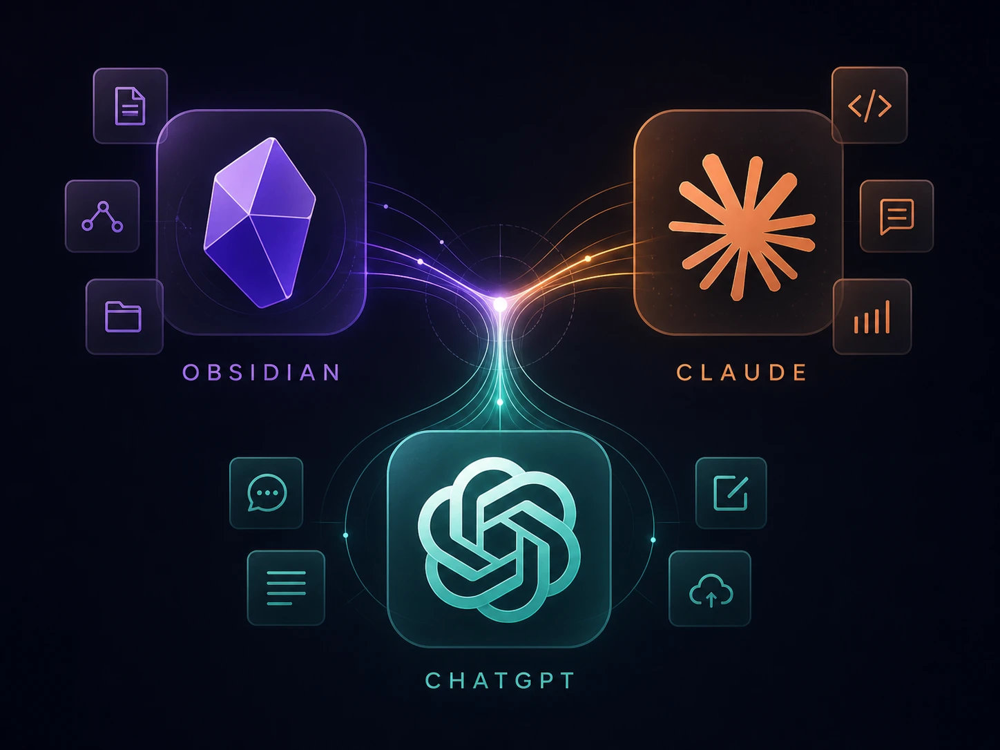

# Agent Ready Knowledge Brain

A multi agent Obsidian vault template for building a portable Knowledge Brain that works with Claude Code, Codex, ChatGPT Projects, Custom GPTs, Antigravity and repository based AI workflows.

<br> <br>

<br> <br>

## Why this exists

A lot of people are already using Obsidian with Claude Code to create what is often called a Knowledge Brain.

The usual setup is simple.

You create an Obsidian vault.  
You add notes, project files, ideas, personal knowledge and structured folders.  
You add a `CLAUDE.md` file to explain how the vault works.  
You run Claude Code inside the vault folder.  
Claude reads the rules and starts helping you work with your notes.

That works well.

But I started asking a different question.

What happens when I do not want to use only Claude?

What happens when I want the same Knowledge Brain to work with different agents?

What happens when the agent does not operate naturally inside the terminal of the Obsidian vault?

That is the real problem this template tries to solve.

Claude Code can work directly inside the local vault. But other agents, such as Codex, GPT based assistants, IDE agents or repository based tools, often need a different operating model.

So the idea is simple.

Obsidian remains the human interface.

The local vault remains the source of truth.

Claude Code can operate locally through the terminal.

Antigravity can open the same local project folder and use Codex, OpenAI’s coding agent, inside an IDE based workflow.

A private GitHub repository becomes the synchronization, portability and access layer.

`CLAUDE.md` guides Claude Code.

`AGENTS.md` guides Codex and repository based agents.

`GPT.md` guides ChatGPT Projects and Custom GPTs.

`commands.md` defines repeatable workflows that all agents can follow.

This turns the vault from a local first note folder into a portable, version controlled, multi environment and multi agent Knowledge Brain.

## The core idea

Most note systems store information.

This template adds an operating model.

A real Knowledge Brain should tell agents:

1. What they must read first.
2. Which domain they are working in.
3. What files they can change.
4. What files they must never touch.
5. Where generated outputs must go.
6. Which privacy rules apply.
7. Which workflow to follow when a command is invoked.
8. What needs to be logged after changes.

Without that structure, an agent has to guess.

And when agents guess inside a knowledge system, they eventually create a mess.

## Why this is different

Most Obsidian and AI setups stop at `CLAUDE.md`.

That is useful, but it usually binds the workflow to one agent, one local terminal workflow and one way of working.

This template is built around a different idea.

The vault is the source of truth.

Different agents should be able to operate on the same structure, with the same rules, the same workflows and the same safety boundaries.

| Agent context | Entry file |
|---|---|
| Claude Code in terminal | `CLAUDE.md` |
| Codex and repository based agents | `AGENTS.md` |
| ChatGPT Projects and Custom GPTs | `GPT.md` |
| All agents | `commands.md` for domain workflows |

A private GitHub repository adds the portability layer.

You can work locally in Obsidian, sync through Git, access the same vault from another machine and let repository based agents operate on the same structure.

You are no longer dependent only on the Obsidian local first model.

You still keep the advantages of local markdown.

But you also gain version control, remote access, reviewable changes and multi agent compatibility.

## What is inside

```text
agent-ready-knowledge-brain/
  CLAUDE.md
  AGENTS.md
  GPT.md
  commands-reference.md

  _bridges/

  docs/
    getting-started.md
    agent-workflow.md
    privacy-model.md

  career/
  projects/
  writing/
  personal/
```

Each domain follows the same pattern:

```text
domain-name/
  CLAUDE.md
  AGENTS.md
  GPT.md
  commands.md
  index.md
  log.md
  raw/
  wiki/
```

## How the main files work

### CLAUDE.md

Used by Claude Code.

This file explains how Claude should operate inside the vault when it is running locally in the terminal.

### AGENTS.md

Used by Codex and repository based agents.

This file explains how agents should operate when they are working through a repository, an IDE extension or a tool such as Antigravity.

### GPT.md

Used for ChatGPT Projects and Custom GPTs.

This file adapts the same knowledge system for agents that may not have direct access to the local vault.

### commands.md

Defines repeatable workflows.

These are not shell commands.

They are markdown based workflow contracts for agents.

For example:

```text
\ingest projects my-first-project
```

This tells the agent to read the relevant domain instructions and follow the documented workflow.

### raw

Stores original source material.

Agents must never modify files inside `raw`.

### wiki

Stores processed and structured knowledge.

Agents can update `wiki` only when the change is supported by source material and the domain rules allow it.

### index.md

Acts as the domain map.

Agents read it before modifying structured knowledge.

### log.md

Records operational changes.

Every write operation should append a short note to the relevant `log.md`.

### _bridges

Stores cross domain synthesis.

A bridge is not a lazy link.

A bridge should exist only when a relationship between domains creates new meaning.


## Why use a private GitHub repository

Obsidian is local first, and that is one of its strengths.

But local first also creates a limitation.

If an agent cannot access the local vault folder, it cannot really operate on the Knowledge Brain. It can only generate text for you to copy.

By syncing the vault with a private GitHub repository, you create a controlled access layer.

This gives you:

1. Access from different machines.
2. Version control.
3. Commit history.
4. Rollback.
5. Branch based experiments.
6. Reviewable diffs.
7. Compatibility with repository based agents.
8. A way for different local environments to work on the same vault.

The repository should be private if your vault contains personal notes, private workflows, career material or sensitive thinking.

Do not put a personal Knowledge Brain in a public repository unless you are absolutely sure it contains no private content.

## Local workflow with Obsidian and Claude Code

This is the classic local workflow.

Open the repository folder as an Obsidian vault.

Then open a terminal in the same folder and run Claude Code.

```bash
cd agent-ready-knowledge-brain
claude
```

Claude Code reads `CLAUDE.md` and follows the vault rules.

This mode is useful when you want a terminal based agent working directly inside the local vault.

The flow is:

```text
Obsidian vault
Local terminal
Claude Code
CLAUDE.md
Markdown files
Git sync
```

## Local workflow with Antigravity and Codex

This template also supports a second local workflow.

Open the same project folder in Google Antigravity.

Antigravity can create its own `.code-workspace` file for the local project environment.

From there, use Codex, OpenAI’s coding agent, to operate on the same vault structure.

Codex should read:

1. The root `AGENTS.md`.
2. The relevant domain `AGENTS.md`.
3. The relevant domain `commands.md` when a command is invoked.
4. The relevant `index.md` before modifying structured knowledge.

This mode is useful when you want a local IDE based agent experience instead of a terminal based Claude Code workflow.

The important point is that both modes operate on the same markdown based vault.

```text
Same local folder
Same Obsidian vault
Same Git repository
Different agent entry files
Different working environments
```

Claude Code uses:

```text
CLAUDE.md
```

Codex uses:

```text
AGENTS.md
```

ChatGPT Projects or Custom GPTs use:

```text
GPT.md
```

The vault remains the source of truth.

## Automatic sync with the Obsidian Git plugin

To keep the local vault synchronized with the private GitHub repository, this template works well with the Obsidian Git plugin by Vinzent, Denis Olehov.

Repository:

```text
https://github.com/Vinzent03/obsidian-git
```

The plugin can automatically commit and sync changes at a defined interval.

The relevant setting is:

```text
Auto commit and sync interval, minutes
```

This commits and syncs changes every X minutes.

The default value is `0`, which disables automatic commit and sync.

A value of `5` minutes can be acceptable for an experienced user with a stable workflow.

For a public template, the safer starting recommendation is:

```text
Start with manual commits.
Enable auto commit and sync only after your workflow is stable.
Use short intervals only if you understand the risks.
```

This matters because agents can create many file changes quickly.

If auto sync is enabled, bad changes can be committed before you review them.

For personal use, 5 minutes may be acceptable if you trust your workflow and review changes regularly.

For beginners, manual sync or a longer interval is safer.

## Important distinction about automatic sync

Agents should not decide to push changes automatically.

Automatic sync is a user configured vault behaviour.

If Obsidian Git is configured to auto commit and sync every few minutes, that is controlled by the user’s vault configuration, not by the agent.

This keeps responsibility clear.

The rule is:

```text
No agent should initiate a push by itself.

If automatic sync is enabled through Obsidian Git, that sync is controlled by the user's vault configuration.
```

Recommended safety rules:

1. Keep the repository private if it contains personal content.
2. Review changes often.
3. Do not let agents initiate push operations by themselves.
4. Use Git history to recover from bad edits.
5. Keep raw files immutable.
6. Avoid running large agent operations right before an automatic sync.
7. Disable auto sync when testing dangerous workflows.
8. Re enable auto sync only after reviewing the result.


## Quick start

### Step 1. Create a private repository from this template

Use this template to create a new GitHub repository.

Keep it private if you plan to store personal or sensitive knowledge.

### Step 2. Clone it locally

```bash
git clone https://github.com/your-username/agent-ready-knowledge-brain.git
cd agent-ready-knowledge-brain
```

### Step 3. Open it in Obsidian

Open the cloned folder as an Obsidian vault.

Everything is markdown.

Nothing is locked into a proprietary format.

### Step 4. Install the Obsidian Git plugin

Install the Obsidian Git plugin.

Repository:

```text
https://github.com/Vinzent03/obsidian-git
```

Recommended first setup:

1. Keep automatic sync disabled at first.
2. Make a few manual commits.
3. Confirm that the repository syncs correctly.
4. Enable auto commit and sync later if needed.

Optional experienced setup:

```text
Auto commit and sync interval, 5 minutes
```

Use this only if you understand that changes may be committed quickly.

### Step 5. Customize your domains

Start with only the domains you need.

For example:

```text
career/
projects/
writing/
personal/
```

Remove what you do not need.

Rename what does not fit your life or work.

Add whatever you think works best for you.

### Step 6. Add source material to raw

Original inputs go into `raw`.

Examples:

```text
projects/raw/my-project.md
writing/raw/article-idea.md
career/raw/job-description.md
```

### Step 7. Run one small workflow

Start with one command.

Do not try to automate your entire life on day one.

Example:

```text
\ingest projects my-first-project
```

The agent should read the relevant `commands.md`, process the raw file and generate structured knowledge inside `wiki`.

### Step 8. Review before committing

Always review the diff.

Then commit.

```bash
git status
git diff
git add .
git commit -m "docs: add first project knowledge workflow"
git push
```

If you use Obsidian Git auto sync, check the Git history regularly.

## Adding a new domain

Each domain should include:

```text
domain-name/
  CLAUDE.md
  AGENTS.md
  GPT.md
  commands.md
  index.md
  log.md
  raw/
  wiki/
```

To add a new domain:

1. Copy an existing domain.
2. Rename the folder.
3. Update `CLAUDE.md`.
4. Update `AGENTS.md`.
5. Update `GPT.md`.
6. Rewrite `commands.md`.
7. Update `index.md`.
8. Keep `raw` immutable.

## How agents use this vault

The general workflow is:

1. Agent reads the root instruction file for its context.
2. Agent identifies the active domain.
3. Agent reads the domain instruction file.
4. If a command is invoked, agent reads `commands.md`.
5. Agent reads `index.md`.
6. Agent reads the required input files.
7. Agent writes outputs to the correct location.
8. Agent appends to `log.md`.
9. Agent shows the diff before committing.
10. Agent does not initiate a push by itself.

If Obsidian Git auto sync is enabled, sync is controlled by the user’s Obsidian configuration.

## Privacy model

The `personal` domain has the strictest rules.

Diary content, health data and private decisions never leave that domain.

Cross domain signals must contain pointers only.

A pointer can say that something exists and may be relevant.

A pointer must not contain private content.

Privacy is not left to the agent's judgement.

Privacy is built into the folder structure and the instruction files.

Read `docs/privacy-model.md` for the full model.

## What this template is not

This is not a magic second brain.

This is not an AI that understands your life by vibes.

This is not a replacement for thinking.

This is not a productivity toy.

This is a structured starting point for building a markdown based Knowledge Brain that different agents can operate on safely.

## Recommended first experiment

Start with the projects domain.

Create this file:

```text
projects/raw/my-first-project.md
```

Add a simple project description.

Then ask your local agent:

```text
\ingest projects my-first-project
```

Expected result:

1. The agent reads the projects instructions.
2. The agent reads the projects command workflow.
3. The agent creates structured wiki content.
4. The agent updates index.md.
5. The agent appends to log.md.
6. You review the diff.
7. You commit or let your configured sync handle it.

If the result is messy, fix the command workflow before adding more domains.

## Related article

This template implements the architecture described in:

**Beyond Claude.md, How to Turn Obsidian into a Multi Agent Knowledge Brain**

Read the full article:

[Beyond Claude.md, How to Turn Obsidian into a Multi Agent Knowledge Brain](https://thehumantechblog.com/posts/beyond-claudemd-how-to-turn-obsidian-into-a-multi-agent-knowledge-brain)

Tip: Use Ctrl plus click, or Cmd plus click on macOS, to open it in a new tab.
## License

MIT.

Use it, fork it, adapt it.

If you build something useful on top of it, share it.
